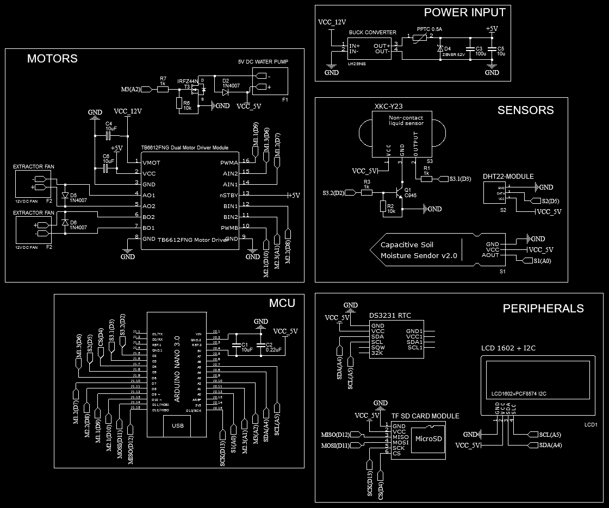

# ArduGrowBox

Still in development.

Based on my project to create a simple automatic growbox for plants. My goal was to control the watering based on soil humidity, and the extractor and aeration fans based on the VPD values (humidity and temperature) of the growbox.

I had absolute no idea of using Arduino, microcontrollers nor electronics at all, so as the project grew, I saw that I needed a repository to upload all my files in one place, while also allowing other people to use it for the sake of not suffering the loss of time I had by creating it.

